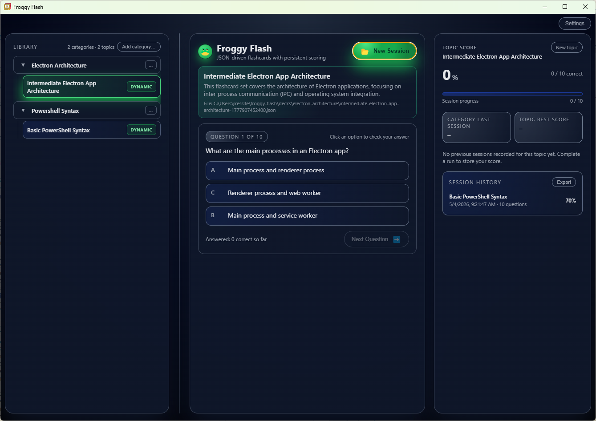

# Froggy Flash

**Master what you need to know—without the noise.** Froggy Flash is a fast, focused Windows desktop experience for multiple-choice practice. Rich Markdown questions, instant feedback, and progress that stays on *your* machine. No accounts, no subscription wall—just you and your library.



---

## Get it on Windows—the easy way

**Installing Froggy Flash on Windows is deliberately simple.** Run the familiar **NSIS setup wizard**: a few clear steps, the app lands in **Start menu** and **Programs**, and you are practicing in minutes.

- **You choose where it lives**—the installer lets you pick the installation folder instead of forcing a hidden path.
- **Standard Windows workflow**—next, next, finish. No command line required for everyday use.
- **Professional presentation**—branded installer and shortcuts so it feels like software you paid for (you didn’t have to).

When you distribute your own builds, run `npm run dist` to produce the **Froggy Flash Setup** installer under `dist/`. That is the same friendly path your users or teammates take to get on board.

---

## Why teams and learners pick Froggy Flash

- **A library that scales**—organize topics into categories, drill what matters, and see progress at a glance.
- **Markdown-powered questions**—code, lists, and emphasis render cleanly so technical content still reads beautifully.
- **Optional AI superpowers**—connect a local **Ollama** model or an **OpenAI-compatible** API to generate or extend decks when you want speed without leaving the app.
- **Your data, your house**—scores, sessions, and decks stay under `%USERPROFILE%\froggy-flash` on Windows (see table below). Back up one folder and you have everything.

---

## Flashcard format & sample content

Deck files are straightforward JSON—documented in [docs/flashcard-format.md](docs/flashcard-format.md). The `cards/` folder ships example sets you can drop into your personal `decks` folder to try the product immediately.

---

## Where your data lives (Windows paths)

| Path | What it holds |
|------|----------------|
| `%USERPROFILE%\froggy-flash\decks` | Categories, manifests, and topic JSON |
| `%USERPROFILE%\froggy-flash\scores.json` | Performance summaries |
| `%USERPROFILE%\froggy-flash\sessions.json` | Session history |
| `%USERPROFILE%\froggy-flash\ui.json` | UI preferences |
| `%USERPROFILE%\froggy-flash\window-state.json` | Window layout |
| `%USERPROFILE%\froggy-flash\llm-settings.json` | LLM connection settings |

On macOS or Linux, substitute `~/froggy-flash/` for the same layout.

---

## Optional updates for packaged builds

Hosting `latest.yml` and your installer artifacts? Set **`FROGGY_UPDATE_URL`** at build time so [electron-updater](https://www.electron.build/auto-update) can deliver seamless in-app updates to your audience.

---

## For developers & contributors

**Requirements:** [Node.js](https://nodejs.org/) (includes npm).

```powershell
npm install
npm start
```

You can also use `.\launch-froggy-flash.ps1` from the repo root. File changes to `index.html`, `renderer.js`, `preload.js`, or `main.js` reload automatically in dev (with a full restart when `main.js` changes).

| Command | What you get |
|---------|----------------|
| `npm run package` | Unpacked Windows x64 app in `dist/` |
| `npm run dist` | NSIS installer in `dist/` (icon prep runs first) |

**Maintainer scripts:** `npm run version:bump:patch|minor|major`, `npm run release-notes`, `npm run release` (see `scripts/new-github-release.ps1`).

---

## License

MIT — see [package.json](package.json).
